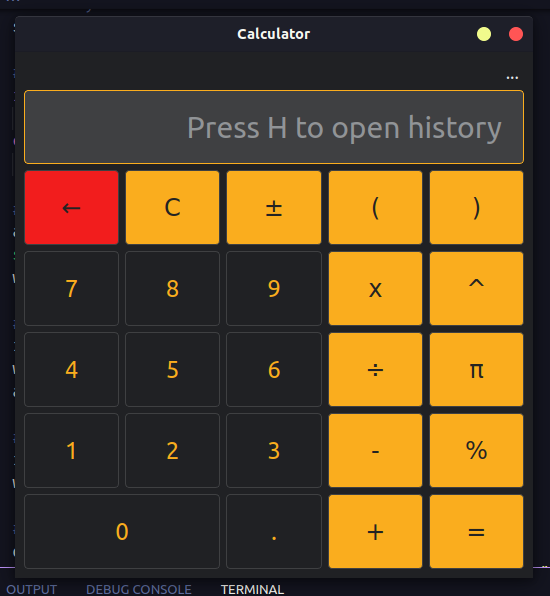

# Calculator (PySide6)



> Making a basic calculator to learn about Pyside6 and classes in Python🐍

## 💻 Pre-Requisites

I tested and programed this calculator in Linux (Ubuntu), so i don't know if it will work in other systems.

- [✓] Linux 🐧
- [✓] Windows 🪟
- [Don't have one to test] Mac 🍎

## 🚀 Installing PySide6 Calculator

To install the project do this, i recommend using a env:

Linux:

```
python3 -m venv .env
source .env/bin/activate

pip install -r requirements.txt

python3 main.py
```

Windows:

```
???
```

## 😄 About me.

I'm learning english, so if i spell something wrong it's part of the process, thanks.
